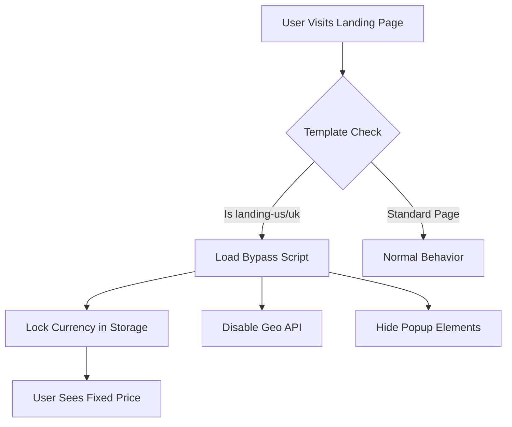

# 🌍 Shopify Geolocation Bypass & Currency Forcer

A robust, client-side solution to create custom landing pages that **force specific currencies** (USD/GBP) and **bypass geolocation redirects/popups**. Perfect for international marketing funnels where you need to control the user experience 100%.

  

## � Visual Preview
https://github.com/user-attachments/assets/72744978-c671-4b9f-abbb-d723c716ade3

### Before & After
| Standard Page (Problem) | Landing Page (Solution) |
|-------------------------|-------------------------|
| ❌ **Redirects** to local store | ✅ **Stays** on intended URL |
| ❌ **Popup** blocks view | ✅ **No Popups** or blockers |
| ❌ **Currency** changes auto | ✅ **Currency Forced** (e.g. USD) |

*(Place an animated GIF here showing a user accessing the US landing page from a different country location via VPN)*

## ✨ Key Features

*   **🔒 Force Currency**: Automatically sets and locks currency cookies, local storage, and session storage to your desired currency (USD/GBP).
*   **🚫 Block Geolocation**: Aggressively intercepts `navigator.geolocation` API calls to prevent location detection.
*   **🛡️ Prevent Redirects**: Stops auto-redirect scripts and "Choose your location" popups from hijacking the user journey.
*   **⚡ Zero Dependencies**: Pure Vanilla JavaScript solution. No external libraries or heavy apps required.
*   **📱 Mobile Responsive**: Works seamlessly on mobile devices where screen real estate is critical.

## 📦 Project Structure

```text
shopify-geolocation-bypass/
├── assets/
│   └── geolocation-bypass.js        # 🧠 Core logic script
├── templates/
│   ├── product.landing-us.json      # 🇺🇸 US Template (Forces USD)
│   └── product.landing-uk.json      # 🇬🇧 UK Template (Forces GBP)
└── README.md                        # 📖 Documentation
```

## 🚀 Quick Start

### 1. Installation
1.  Upload `assets/geolocation-bypass.js` to your theme's **Assets** folder.
2.  Upload the files in `templates/` to your theme's **Templates** folder.

### 2. Integration
Add this snippet to your `layout/theme.liquid` file, inside the `<head>` tag (before `{{ content_for_header }}`):

```liquid

  <script src="{{ 'geolocation-bypass.js' | asset_url }}" defer="defer"></script>

```

### 3. Usage
1.  Go to **Shopify Admin > Products**.
2.  Select the product you want to use as a landing page.
3.  Change the **Theme Template** to `landing-us` (for USD) or `landing-uk` (for GBP).
4.  **Done!** visit the page. It is now secured against geolocation switching.

## 🧩 How It Works

### Architecture Flow


1.  **Template Detection**: logic in `theme.liquid` detects if a special landing template is active.
2.  **Script Injection**: `geolocation-bypass.js` is loaded *only* on these pages.
3.  **Bypass Execution**: The script immediately locks currency variables and overrides browser geolocation functions before other scripts load.

## 🧪 Testing Checklist

Ensure your setup is production-ready by checking these items:

- [ ] **VPN Test**: Access the page from a different country (e.g., standard UK IP visiting US landing page).
- [ ] **Currency Check**: Verify the currency symbol remains fixed (e.g., `$`) and doesn't flicker.
- [ ] **Popup Check**: Confirm no "Select your region" modals appear.
- [ ] **Cart Flow**: Add item to cart and verify currency persists to checkout.

## 🤝 Browser Support

| Chrome | Firefox | Safari | Edge | iOS/Android |
| :---: | :---: | :---: | :---: | :---: |
| ✅ | ✅ | ✅ | ✅ | ✅ |

## 💬 Contact & Support

Created for high-performance dropshipping and international sales funnels.

**Issues?** Open an issue in this repository.<br>
**Author**: Rafael Susano/rsusano

---
*Made with ❤️ for the Shopify Community*
